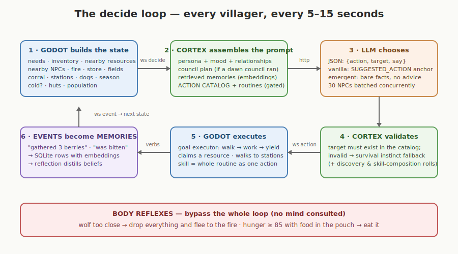
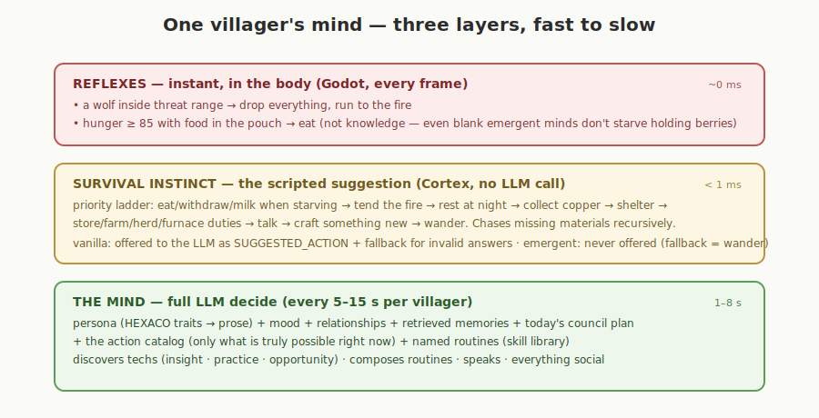
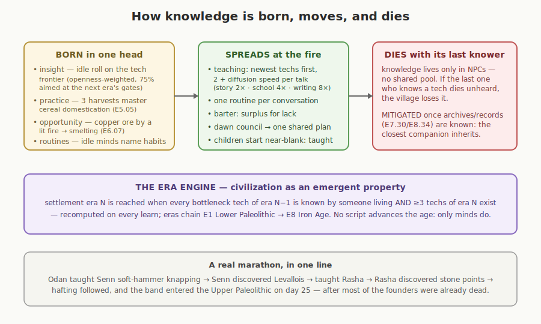

# VOX — Architecture

How a voxel world, a Python cognition service, and a rack of language models
become one living village. Companion to `00_MASTER_PLAN.md` (vision),
`01_TECH_TREE.md` (content), and `04_GAMEPLAY_ROADMAP.md` (feature waves).

---

## 1. The stack — three processes, one contract

VOX is split along one hard line: **bodies are Godot's, minds are Cortex's,
wits are rented from any OpenAI-compatible LLM host.**

| Process | Owns | Never touches |
|---|---|---|
| **Godot** (`godot/`) | terrain, physics, items, positions, needs decay, structures, predators, time/seasons, save file | prompts, memories, knowledge |
| **Cortex** (`cortex/`) | personas, memories (SQLite), known techs & skills, relationships, mood, discovery, eras, councils | items, positions — it *decides*, it cannot *do* |
| **LLM hosts** | token generation only | all state (they are stateless; `brain_pool` spreads NPCs across models round-robin) |

They meet in two places:

- **The wire** — a WebSocket (`ws://…:8765/ws`) carrying small JSON messages
  (§4). Godot works fine with the socket down (offline fallback, reconnects).
- **The data** — `data/*.json` is read by *both* sides:
  `tech_tree.json` (440 nodes, eras E1–E10), `era1_content.json` (resources,
  items, recipes, buildables, needs), `traits.json` (personality axes).
  Cortex uses it to know what an NPC *may* do; Godot uses the same rows to
  *execute* it. Adding content is almost always a data-only change.

## 2. The decide loop

Every living villager runs this loop every 5–15 s (each request is its own
asyncio task, so ~30 concurrent decides batch inside vLLM instead of queueing):

1. **Godot builds the state** — needs, inventory, what's actually nearby
   (perception radius), fire/store/field/corral/station census, season, cold.
2. **Cortex assembles the prompt** — persona prose (compiled from HEXACO-ish
   trait scores), current mood, relationships, the day's council plan,
   embedding-retrieved memories, and the **action catalog**: only recipes the
   NPC knows *and* can physically attempt right now (station built? herd
   present? field ripe?), plus their named routines.
3. **The LLM answers** one JSON object: `{action, target, say}`.
4. **Cortex validates** — a target that isn't in the catalog falls back to the
   scripted survival instinct (vanilla) or a wander (emergent). Idle decides
   also roll discovery insights and skill composition here.
5. **Godot executes** — the goal executor walks, works, claims resources
   (claims expire in 25 s, so nothing is ever hidden forever), visits stations,
   or runs a whole skill routine step by step.
6. **Events become memories** — everything done or suffered returns to Cortex
   as an event line, stored with an embedding; every ~30 importance points a
   reflection pass distills recent memories into beliefs.

## 3. One villager's mind — three layers

Fast-to-slow, cheap-to-expensive — only the top layer costs tokens:

- **Reflexes** (Godot, per frame): flee a close wolf; eat from the pouch when
  starving. Bodily, not knowledge — even blank emergent minds get these.
- **Survival instinct** (Cortex, no LLM): a priority ladder from "eat now"
  down to "craft something new", able to chase missing materials recursively
  (need a hoe → make a hoe → need a flake → knap → gather flint). In vanilla
  it anchors the LLM as `SUGGESTED_ACTION` and catches invalid answers; in
  emergent it is never shown — minds sink or swim.
- **The mind** (LLM): everything social, everything creative — speech,
  teaching, discovery, routines, plans.

## 4. The protocol

| Direction | Message | Purpose |
|---|---|---|
| → Cortex | `hello {flavor}` | handshake; switches vanilla/emergent roster |
| → Cortex | `decide {npc, state, tier}` | the loop of §2 |
| → Cortex | `event {npc, text}` | memories; also drives practice-based tech (3 harvests → E5.05) |
| → Cortex | `chat {npc, text}` | the human player talking to a villager |
| → Cortex | `converse {a, b, inv_a, inv_b}` | two NPCs met: dialogue → teaching → skill pass → barter |
| → Cortex | `council {npcs, report}` | dawn assembly (optional feature) |
| → Cortex | `died / birth / social(gift)` | lifecycle & bonds |
| Cortex → | `roster {npcs, flavor}` | who exists (minds are cast in Cortex, bodies spawn in Godot) |
| Cortex → | `action {npc, action, target, say, steps?, learned?}` | the decision; `steps` = a skill routine |
| Cortex → | `say / learned / skill / trade / era / born / council_end / converse_end / status` | world-visible outcomes |

## 5. Knowledge, culture, and the era engine

There is **no global tech pool**: every fact lives in some villager's SQLite.
Knowledge is *born* in one head (idle insight aimed at the next era's
bottlenecks, practice, or the copper-in-the-hearth opportunity event), it
*spreads* only through conversation (techs newest-first, capped by the
settlement's diffusion tier; one skill routine per talk; barter; the council
plan), and it *dies* with its last knower — unless archives (E7.30/E8.34) are
known, in which case the closest companion inherits. The settlement's era is
recomputed on every learn; no script ever advances the age.

Two **flavors** select how much scaffolding minds get (New Game menu):

- **vanilla** — one guided village of 10 named personas; suggestion anchor on.
- **emergent** — two villages of 5 (two families each, kin bonds > friendship),
  blank minds, bare-fact prompts, one seeded goal: *build a civilisation*.
  Separate memory world (`data/memory_emergent/`).

## 6. The dawn pipeline

At each dawn Godot runs, in order: season update → aging & old-age deaths →
birth roll → **economy** (spoilage on pouches and stores, vermin raids on
non-safe caches) → **fields** (crop growth, winter frost) → **herds**
(breeding) → chronicle line → **council** (optional: each village rings its
fire, reports, and one agreed plan is injected into every mind for the day).

## 7. Persistence

| What | Where | Survives |
|---|---|---|
| terrain seed, day, season, structures + stores/herds/fields, fire fuel, bodies (position, needs, inventory), counters, dogs, council flag | `user://vox_save.json` (autosave each dawn; menu **Continue**) | Godot restart |
| memories, beliefs, relationships, known techs, skill routines, mood, death flags, runtime-born personas | `cortex/data/memory*/<npc>.sqlite` | Cortex restart (children resurrect, the dead stay dead) |

The two halves re-attach cleanly: bodies are restored by Godot, minds never
left Cortex.

## 8. Deployment & scaling

- Godot runs on the Windows desktop; Cortex anywhere Python runs; LLMs on
  Ubuntu GPU hosts (`VOX_CORTEX_URL` points Godot at a remote Cortex;
  `server.host: 0.0.0.0` exposes it — LAN/SSH-tunnel only, no auth).
- `brain_pool` assigns models to NPCs round-robin; `POST /bind/<npc>` rebinds
  one villager to a different model at runtime (the HUD shows each mind).
- Cost levers: decide cadence (`WANDER_MIN/MAX`), `COUNCIL_SPEAKERS`,
  `skill_rate`, `VOX_DISCOVERY_RATE`, and the `tier: scripted` path (no LLM)
  kept as offline fallback.

## 9. Testing

- `cd cortex && python tests/test_cortex.py` — 22 offline tests (mock LLM):
  protocol, memory, teaching, discovery, storage, farming, herding, metal,
  trade, skills, council, flavors, death/mitigation, persistence.
- Godot headless: `--import` (class cache), then env-driven runs
  (`VOX_MAP_CHUNKS`, `VOX_SEED`, `VOX_DAY_SECONDS`, `VOX_COUNCIL`,
  `VOX_START_CACHE/CORRAL/SMELTER` test hooks) against
  `config.mocktest.yaml` on port 8766 — the whole village runs with zero GPUs.
