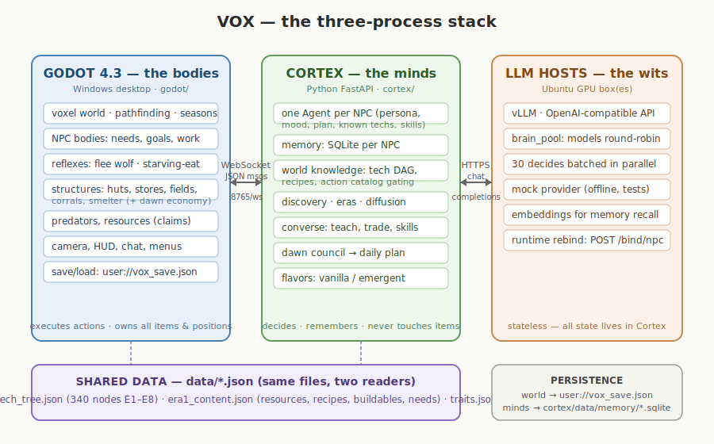

# VOX

**A voxel world where LLM-driven villagers climb from the Stone Age to the
Middle Ages — by living, talking, and figuring it out.**

No quest scripts, no global tech pool. Every villager is a persistent mind
with a personality, memories, moods, relationships, and a pouch of things it
carries. Knowledge exists only in heads: it is *discovered* by one villager
(insight at the fire, seasons of practice, a copper nugget left in the
hearth), *spreads* only through conversation (teaching, routines, barter,
dawn councils), and *dies* with its last knower. The settlement's era — Lower
Paleolithic through the Middle Ages, across a 440-node tech tree — is an emergent
property of who knows what and who talked to whom before they died.



## What villagers do

- **Survive**: forage, hunt, trap, fish, cook, keep the fire alive, flee
  wolves, pound herbs into medicine, shelter from winter — needs, health,
  aging, and death are all real. The dead lie where they fell until a
  villager who knows the rite digs them a grave — or, in three days, the
  wilds scatter the bones.
- **Learn**: discover technologies at their personal knowledge frontier —
  by insight at the fire, by seasons of practice, or by a copper nugget left
  in the hearth — and teach them, newest first. Children are born near-blank
  and must be taught before the old knowers die. Schools, universities, and
  eventually **printed books** (read one, learn its technology — knowledge
  that outlives its author) raise the stakes.
- **Work the land**: farm behind ox-drawn plows, herd goats, sheep, cattle
  and pigs, smoke and salt and pickle the surplus into stores, and let
  watermills, windmills, presses, and smoking racks work while everyone
  sleeps.
- **Build a civilization**: brush huts → mudbrick houses → concrete
  bathhouses, theaters, fountains, and stone walls that keep the wolves
  (and the raiders) out. Kilns, smelters, blast furnaces, and trip hammers
  carry the toolkit from flint to cast iron.
- **Build culture**: compose reusable work routines (a Voyager-style skill
  library) and pass them on; barter surpluses, mint coins, and buy at the
  market stall; hold optional dawn councils that set a shared plan for the
  day.
- **Clash — if they choose to**: in two-village games a mind (never a game
  rule) may decide to raid a rival's stores. Nobody dies; everybody
  remembers. Grudges, revenge, and gift-bought peace are left entirely to
  the minds.
- **Talk to you**: double-click any villager and chat — they remember you
  across restarts. Press **T** to call out to the whole village at once;
  single clicks inspect whatever they land on (who built that hut, and when).

Two flavors per game: **vanilla** (one guided village of 10 named personas)
or **emergent** (two villages of blank minds with a single seeded goal —
*build a civilisation* — and nothing else).

## The stack

Three processes, one contract (full details in
[05_ARCHITECTURE.md](05_ARCHITECTURE.md)):

- **[godot/](godot/)** — Godot 4.3: the world and every *body* (items,
  needs, structures, predators, seasons, save/load).
- **[cortex/](cortex/)** — Python FastAPI: every *mind* (personas, SQLite
  memories with embeddings, discovery, teaching, councils), speaking a small
  JSON protocol over WebSocket.
- **Any OpenAI-compatible LLM host** — vLLM on a GPU box, several models
  round-robined across villagers, or the built-in mock provider for running
  the whole village offline (that's how the 30 tests work). Endpoints can
  be managed in-game — Options → **LLM connections** finds each server's
  models, test-fires them, and rebinds every villager live.

## Getting started

See **[QUICKSTART.md](QUICKSTART.md)** — from zero to a living village,
including offline mode (no GPU needed), remote GPU setups, controls,
time-lapse marathons, and troubleshooting.

```
cd cortex && pip install -r requirements.txt
python -m cortex --config config.mock.yaml     # offline minds, no GPU
# then open godot/ in Godot 4.3 and press Play
```

## Documentation

| Doc | What's in it |
|---|---|
| [00_MASTER_PLAN.md](00_MASTER_PLAN.md) | vision and phase history |
| [01_TECH_TREE.md](01_TECH_TREE.md) | the 440-node tree, eras E1–E10 |
| [02_WORLD_ELEMENTS.md](02_WORLD_ELEMENTS.md) | world design |
| [03_NPC_PERSONALITY.md](03_NPC_PERSONALITY.md) | trait system, personas |
| [04_GAMEPLAY_ROADMAP.md](04_GAMEPLAY_ROADMAP.md) | feature waves A–N and their status |
| [05_ARCHITECTURE.md](05_ARCHITECTURE.md) | the stack, decide loop, mind layers, protocol |
| [QUICKSTART.md](QUICKSTART.md) | how to run everything |

## License

Code, documentation, and data are **MIT** — see [LICENSE](LICENSE).

Third-party 3D models under `godot/assets/` keep their original licenses
(details in [godot/assets/README.md](godot/assets/README.md)).

## Credits

**CC0 / Public Domain models** (no attribution required, but thank you):
[Kenney](https://kenney.nl) (villagers, campfire, nature props),
[Quaternius](https://quaternius.com) (deer, wolf, boar, sheep & goat, ore
rocks, silo, crops).

**CC-BY 3.0 models** (attribution required — via [Poly Pizza](https://poly.pizza)):
"Field of wheat", "Stones", "Picnic Basket", "Farm house", and
"Cottontail rabbit" by **Poly by Google**; "Soil mount" by **apelab**;
"Forge" by **Don Carson**.

Built with [Godot 4.3](https://godotengine.org),
[FastAPI](https://fastapi.tiangolo.com), and
[vLLM](https://github.com/vllm-project/vllm). The skill library is inspired
by [Voyager](https://voyager.minedojo.org/) (NVIDIA GEAR).
